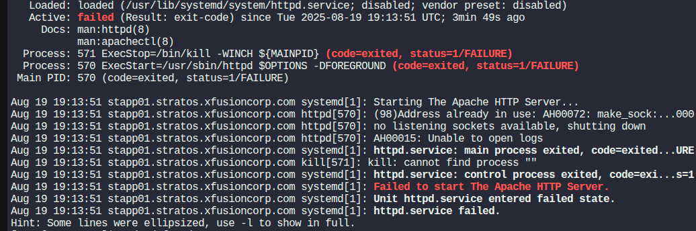
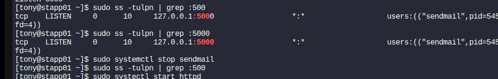

### How I Fixed Apache Not Starting Due to Port Conflict

Here's how I personally troubleshooted and fixed an issue where Apache (`httpd`) wouldn't start because the port it needed was already in use.

-----


### 1. Spotting the Problem

When I tried to start Apache, I got an `Address already in use` error. This means something else was already using the port Apache wanted (in my case, port 5000). To see what was going on, I checked the status of the service:

```bash
sudo systemctl status httpd
```

This command (with `sudo` for permissions) shows if Apache is running or if it failed, and gives useful logs.

-----


### 2. Finding Out What's Using Port 5000

Since Apache couldn't bind to port 5000, I needed to see what was already using it. I used the `ss` command for this:

```bash
sudo ss -tulpn | grep :5000
```


Here's what the options mean:
- `sudo`: Needed to see process info
- `ss`: Shows socket info
- `-t`: Only TCP sockets
- `-u`: Only UDP sockets
- `-l`: Only listening sockets
- `-p`: Show process using the socket
- `-n`: Show numbers, not names
- `| grep :5000`: Only show lines with port 5000

The output will show which process (and PID) is using port 5000. For example:
`tcp LISTEN 0 50 *:5000 *:* users:(("httpd",pid=570,fd=4))`

-----

sudo systemctl stop <service name>

### 3. Stopping Whatever's Using Port 5000

Once I found the PID, I stopped the process to free up the port. You can do this with:

```bash
sudo kill -9 <PID>
```
or, if it's a service:
```bash
sudo systemctl stop <service name>
```

I usually try `kill -15 <PID>` first (gentler), but `-9` will force it if needed.

-----


### 4. Restarting Apache and Making Sure It Works

With port 5000 free, I restarted Apache:

```bash
sudo systemctl start httpd
sudo systemctl status httpd
```

If everything worked, Apache started up fine and the status showed it was running. Problem solved!